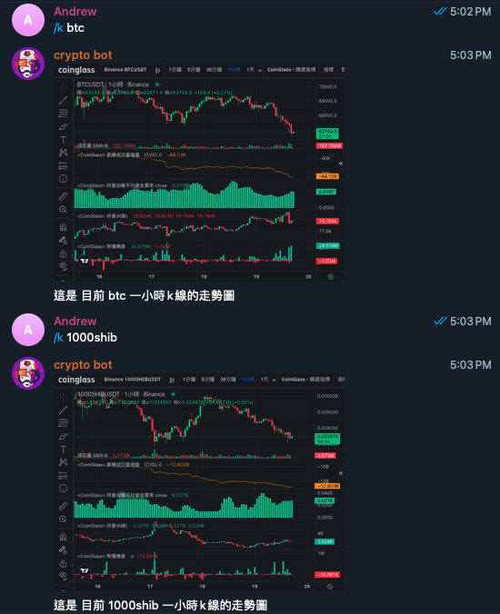

# Crypto - Telegram Bot 


## Project setup
```
npm install
```
___
## 指令
```
/start
```
<details>
<summary>詳細資訊</summary>
  

</details>

```
/price
```
<details>
<summary>詳細資訊</summary>
</details>

```
/price top
```
<details>
<summary>詳細資訊</summary>
</details>

```
/k XXX
```
<details>
<summary>詳細資訊</summary>
</details>

```
/plate
```
<details>
<summary>詳細資訊</summary>
</details>

